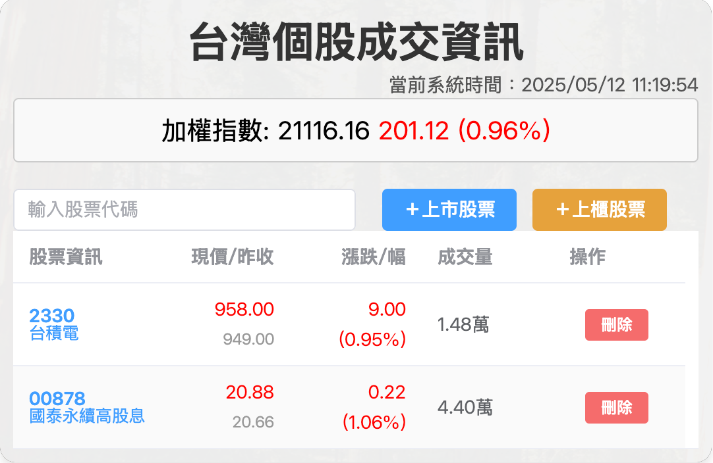

# 歡迎使用 `TWSX` 台股速報

[TWSX]([https://markdown.lovejade.cn/?ref=markdown.lovejade.cn](https://github.com/aluminum711/twsx/tree/widget))，這是直接從 "台股速報 (TW Stock Express)" 中提取首字母組合而成，「速報」強調訊息的及時性，「Express」則傳遞了快速、便捷的意味。

功能
1. 支持顯示台股集中市場加權指數
2. 支持增刪台股上市股票
3. 支持增刪台股上櫃股票

後續開發
1. 新增個股歷史數據圖
2. 支持陸股、美股市場
3. 導入AI進行股票分析

---

## 如何使用

1. get source code from git
 
   `https://github.com/aluminum711/twsx.git`
   
2. updates and manages downloads of dependencies
 
   **backend**
   `cd backend`
   
   `npm install or pnpm install`
   
   `cd ..`
   
   **frontend**
   `cd stock-monitor`
   
   `npm install or pnpm install`
   
   `cd ..`
   
   **project**
   `npm install or pnpm install`
   
3. build mac [ARM] and win package
 
   `sudo npm run electron:build`

## 示例

## 贊助

最新更新 2025.05.12
